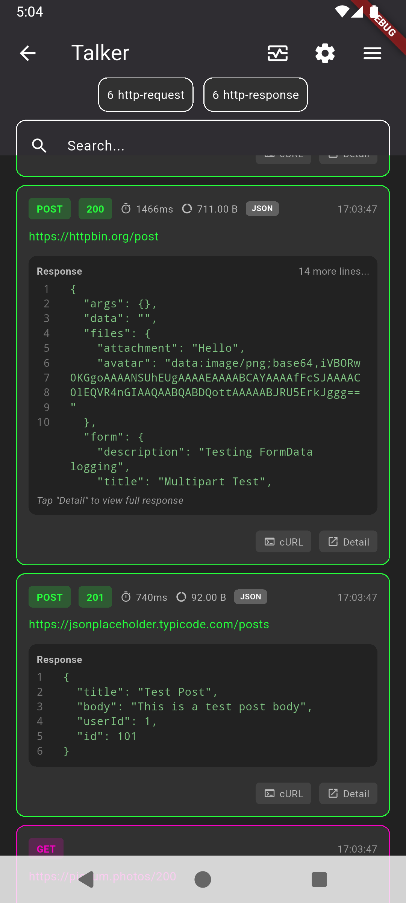
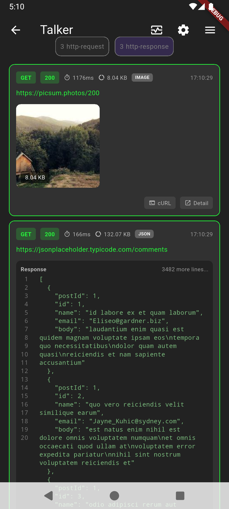
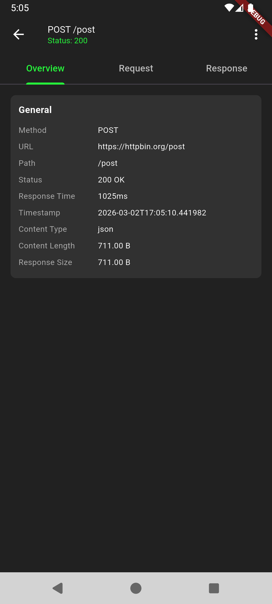
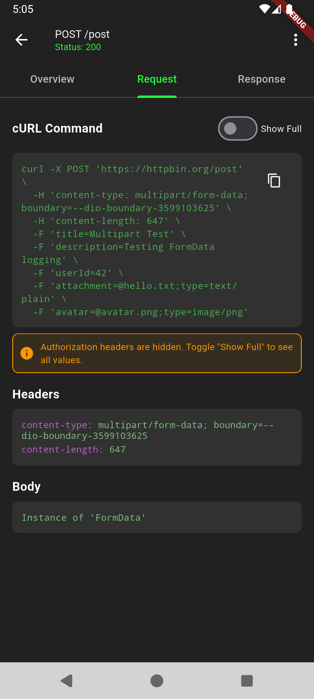
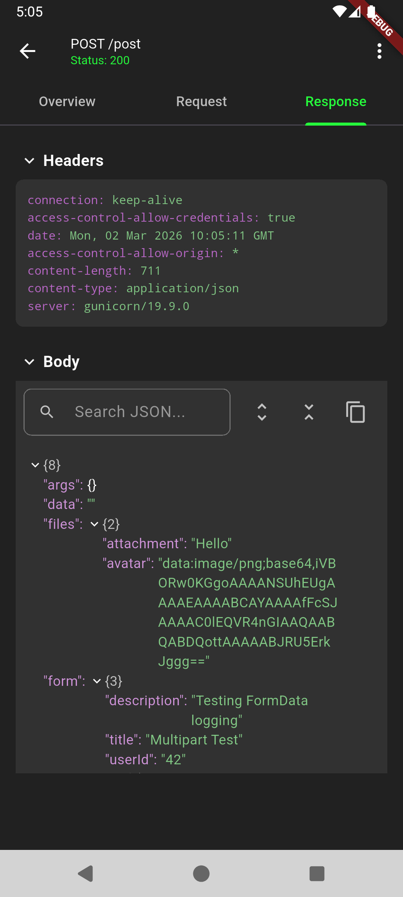
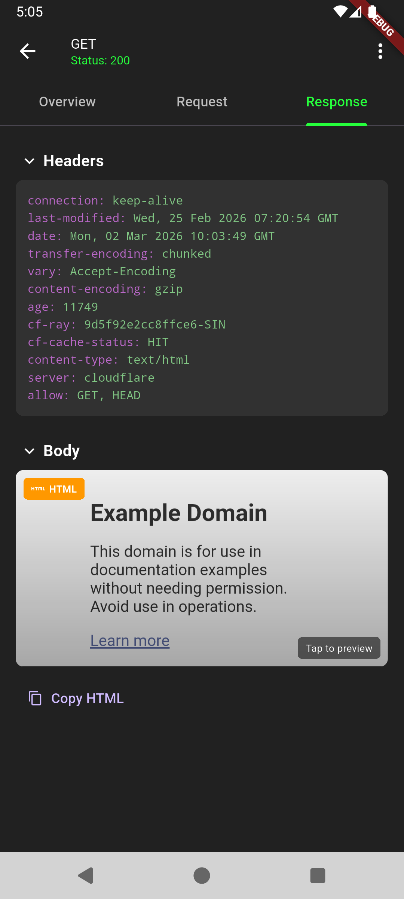
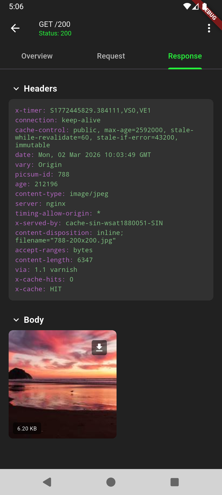

# Talker Dio Logger Plus

[](https://pub.dev/packages/talker_dio_logger_plus)
[](https://pub.dev/packages/talker_dio_logger_plus/score)
[](https://github.com/Frezy_Mv/talker_dio_logger_plus/blob/main/LICENSE)

A Dio HTTP logger built on top of [Talker](https://pub.dev/packages/talker) that goes beyond what `talker_dio_logger` offers out of the box.

> This is a personal pet project. It scratches a specific itch and is shared as-is — contributions and feedback are welcome, but support and maintenance are best-effort.

## Motivation

`talker_dio_logger` is great as a foundation, but its HTTP output is fairly minimal — large JSON bodies get dumped as a wall of text in the console, and there's no dedicated UI for inspecting individual requests.

The goal here was something closer to [Chucker](https://github.com/ChuckerTeam/chucker) (the Android HTTP inspector) but built with Talker design and with more features on top:

- Each request shows up as a card in Talker's log list with a small preview of the response — enough context to spot problems without opening anything
- Tapping a card opens a detail screen with tabbed views for the request, response, and a ready-to-run cURL command — similar to Chucker's layout, but extended
- Large JSON responses are truncated in the card view so the list stays readable, while the full payload is accessible in the detail view
- cURL export includes auth token masking so you can share commands with teammates without leaking credentials
- ZIP export and system share sheet support for sending full request/response logs across tools or to other people

The JSON detail viewer is functional but still has rough edges — a migration to a more robust JSON viewer library is planned.

## Screenshots

### Log List

Cards show method, endpoint, status, response time, and a small response preview — including inline image thumbnails when the response is an image.

| JSON response | Image response |
|:---:|:---:|
|  |  |

### Detail View

Tapping a card opens a tabbed detail screen.

| Overview | Request |
|:---:|:---:|
|  |  |

**Response tab** — rendered differently depending on content type:

| JSON | HTML | Image |
|:---:|:---:|:---:|
|  |  |  |

## Features

### Core Features

- **cURL Command Generation** - Copy requests as cURL with option to hide sensitive data
- **JSON Viewer** - Basic JSON viewer with search and syntax highlighting *(current implementation has known limitations — a migration to a more robust JSON viewer library is planned)*
- **Smart Truncation** - Automatically truncate large payloads while preserving full data for detail view
- **Multi-format Response Support** - JSON, HTML, Image, and plain text handling

### Security Features
- **Hidden Headers** - Automatically hide sensitive headers like Authorization, API keys
- **Safe cURL Export** - Export cURL commands with hidden auth tokens
- **Bearer Token Masking** - Show `Bearer *****` instead of actual token

### Content Type Handling
- **JSON** - Basic viewer with search and syntax highlighting *(migration to a more robust viewer planned)*
- **Images** - Inline preview for small images, tap to view for large images
- **HTML** - Preview with option to view full rendered content
- **Text** - Plain text display with full content support

### Export & Download
- **Download as ZIP** - Export request/response as a ZIP file (iOS/Android/Web compatible)
- **Share** - Share logs via system share dialog
- **Copy** - Copy individual sections or full cURL command
- **Pluggable File Saver** - Customize or disable file saving behavior

### Detail View Features
- **Tabbed Interface** - Overview, Request, Response, and cURL tabs
- **Search in JSON** - Find specific keys or values with highlighting *(may have edge-case issues; viewer migration planned)*
- **Full Headers View** - See all request and response headers
- **Response Time** - Track request duration

## Installation

Add to your `pubspec.yaml`:

```yaml
dependencies:
  talker_dio_logger_plus: ^1.0.6
```

## Requirements

This package depends on the following packages. They are declared as direct dependencies and will be installed automatically, but your project must meet the minimum version constraints listed below:

| Package | Version           | Purpose                                                                           |
|---------|-------------------|-----------------------------------------------------------------------------------|
| [dio](https://pub.dev/packages/dio) | `^5.4.0`          | HTTP client — the interceptor hooks into Dio's request/response pipeline          |
| [talker](https://pub.dev/packages/talker) | `>=4.5.0`         | Core logging sink — all HTTP events are sent to a `Talker` instance               |
| [talker_flutter](https://pub.dev/packages/talker_flutter) | `>=4.5.0`         | Flutter UI components (`TalkerScreen`, `TalkerScreenTheme`) used by `HttpLogCard` |
| [flutter_inappwebview](https://pub.dev/packages/flutter_inappwebview) | `^6.1.5`          | In-app WebView for rendering full-screen HTML responses                           |
| [path_provider](https://pub.dev/packages/path_provider) | `^2.1.0`          | Resolves the temporary/documents directory used by `DefaultFileSaver`             |
| [share_plus](https://pub.dev/packages/share_plus) | `>=10.1.4`        | System share sheet used by `DefaultFileSaver.shareFile`                           |
| [archive](https://pub.dev/packages/archive) | `^4.0.2`          | ZIP creation used by `DefaultFileSaver.saveHttpLogToZip`                          |
| [mime](https://pub.dev/packages/mime) | `>=1.0.4 < 3.0.0` | MIME-type lookup used alongside `dio`                                             |

> **Note:** `path_provider`, `share_plus`, and `archive` are only exercised by `DefaultFileSaver`. If you supply a custom `FileSaverInterface` implementation or set `fileSaver: null`, those packages are still linked but their code paths are never reached at runtime.

### Dart & Flutter SDK

| SDK | Minimum version |
|-----|----------------|
| Dart SDK | `>=3.7.0` |
| Flutter SDK | `>=3.29.0` |

## Quick Start

```dart
import 'package:dio/dio.dart';
import 'package:talker_flutter/talker_flutter.dart';
import 'package:talker_dio_logger_plus/talker_dio_logger_plus.dart';

void main() {
  final talker = Talker();
  
  final logger = AdvancedDioLogger(
    talker: talker,
    settings: const AdvancedDioLoggerSettings(
      printRequestData: true,
      printResponseData: true,
      printResponseTime: true,
      hiddenHeaders: {'authorization', 'x-api-key'},
      hideAuthorizationValue: true,
    ),
  );
  
  final dio = Dio();
  dio.interceptors.add(logger);
}
```

## Configuration

### AdvancedDioLoggerSettings

```dart
AdvancedDioLoggerSettings(
  // Enable/Disable
  enabled: true,
  logLevel: LogLevel.debug,
  
  // Print settings
  printRequestData: true,
  printRequestHeaders: true,
  printRequestExtra: false,
  printResponseData: true,
  printResponseHeaders: true,
  printResponseMessage: true,
  printResponseTime: true,
  printErrorData: true,
  printErrorHeaders: true,
  printErrorMessage: true,
  
  // Security
  hiddenHeaders: {'authorization', 'x-api-key', 'api-key'},
  hideAuthorizationValue: true,
  
  // Per-content-type display limits (replaces flat truncation thresholds)
  // enablePreview controls whether the UI card/detail screen renders a visual
  // preview widget for that content type. It has NO effect on console output —
  // use printResponseData / printRequestData to suppress console output instead.
  cardDisplayLimit: DisplayLimitRegistry(
    overrides: {
      HttpBodyType.json: DisplayLimit(maxBytes: 500 * 1024, maxLines: 20),
      HttpBodyType.image: DisplayLimit(maxBytes: 5 * 1024),
      HttpBodyType.html: DisplayLimit(enablePreview: false), // hide HTML preview in UI
    },
  ),
  
  // Feature flags
  enableCurlGeneration: true,
  
  // JSON viewer soft wrap width (null = no wrap, horizontal scroll)
  jsonSoftWrapTextValueAtWidth: null,
  
  // Custom file saver (set to null to disable download/share)
  fileSaver: const DefaultFileSaver(), // or null, or your custom implementation
  
  // Filters
  requestFilter: (options) => true,
  responseFilter: (response) => true,
  errorFilter: (exception) => true,
)
```

## Using with TalkerScreen

To use the custom HTTP log cards in TalkerScreen:

```dart
TalkerScreen(
  talker: talker,
  itemsBuilder: (context, data) {
    if (isAdvancedHttpLog(data)) {
      return HttpLogCard(
        data: data,
        expanded: true,
      );
    }
    // Return default card for other log types
    return TalkerDataCard(
      data: data,
      color: data.getFlutterColor(theme),
      backgroundColor: theme.cardColor,
    );
  },
)
```

## Theme Support

### TalkerThemeProvider

The package uses `TalkerThemeProvider` (an `InheritedWidget`) to provide consistent theming across all screens without prop drilling. When you navigate to detail screens, the theme is automatically available to all child widgets.

The `HttpLogCard` automatically wraps navigation with `TalkerThemeProvider`, so child screens like `FullScreenImageViewer` and `FullScreenHtmlPreview` can access the theme via:

```dart
final theme = TalkerThemeProvider.of(context);
```

### Custom Theme

You can customize the theme by passing a `TalkerScreenTheme` to `HttpLogCard`:

```dart
HttpLogCard(
  data: data,
  expanded: true,
  theme: TalkerScreenTheme(
    backgroundColor: Colors.black,
    cardColor: Color(0xFF1E1E1E),
    textColor: Colors.white,
    // ... other theme properties
  ),
)
```

## Custom File Saver

The package provides a pluggable file saving system through `FileSaverInterface`. This allows you to:

- Use the default implementation (`DefaultFileSaver`)
- Disable file operations (set `fileSaver: null`)
- Provide your own custom implementation

### Default Behavior

By default, the package uses `DefaultFileSaver` which requires `path_provider`, `archive`, and `share_plus` packages.

### Disable File Saving

If you don't need file saving/sharing functionality:

```dart
final logger = AdvancedDioLogger(
  settings: AdvancedDioLoggerSettings(
    fileSaver: null,
  ),
);
```

### Custom Implementation

Create your own file saver by implementing `FileSaverInterface`:

```dart
class MyCustomFileSaver implements FileSaverInterface {
  @override
  Future<String?> saveToFile({
    required String filename,
    required dynamic data,
    String? directory,
  }) async {
    // Your custom save logic
  }

  @override
  Future<String?> saveHttpLogToZip(HttpLogData logData, {String? filename}) async {
    // Your custom ZIP creation logic
  }

  @override
  Future<void> shareFile({required String filepath, String? subject, String? text}) async {
    // Your custom share logic
  }

  @override
  Future<void> shareText(String text, {String? subject}) async {
    // Your custom text share logic
  }

  @override
  Future<void> saveAndShareHttpLog(HttpLogData logData) async {
    // Your custom save and share logic
  }

  @override
  Uint8List? getBytes(dynamic data) {
    // Convert data to bytes
  }
}

// Use it
final logger = AdvancedDioLogger(
  settings: AdvancedDioLoggerSettings(
    fileSaver: MyCustomFileSaver(),
  ),
);
```

## Content Type Detection

The logger automatically detects content types:
- **JSON**: `application/json`, `text/json`
- **HTML**: `text/html`, `application/xhtml+xml`
- **Images**: `image/jpeg`, `image/png`, `image/gif`, etc.
- **XML**: `text/xml`, `application/xml`
- **Text**: `text/plain`

## Size Handling

Display limits are configured per content type via `DisplayLimitRegistry`. Defaults:

| Content Type | maxBytes | maxLines | enablePreview | Behavior |
|-------------|----------|----------|---------------|----------|
| JSON | 1 MB | 20 | `true` | Truncated in card, full in detail view |
| Text / XML | 1 MB | 20 | `true` | Truncated in card, full in detail view |
| HTML | 1 MB | 20 | `true` | WebView preview, tap for full screen |
| Image | 5 KB | 20 | `true` | Inline preview if ≤ 5 KB, placeholder if larger |
| Unknown | 1 MB | 20 | `true` | Binary sentinel string |

`enablePreview` controls whether the **UI card and detail screen** render a visual preview widget for that content type. When `false`, a "preview disabled" notice is shown instead. It has **no effect on console/text log output** — use `printResponseData` / `printRequestData` to suppress console output.

Override defaults via `cardDisplayLimit` in `AdvancedDioLoggerSettings`.

## Platform Support

| Feature | iOS | Android | Web |
|---------|-----|---------|-----|
| cURL Generation | ✅ | ✅ | ✅ |
| JSON Viewer | ✅ | ✅ | ✅ |
| Image Preview | ✅ | ✅ | ✅ |
| Download ZIP | ✅ | ✅ | ⚠️* |
| Share | ✅ | ✅ | ⚠️* |

*Web has limited file system access

## License

MIT License
